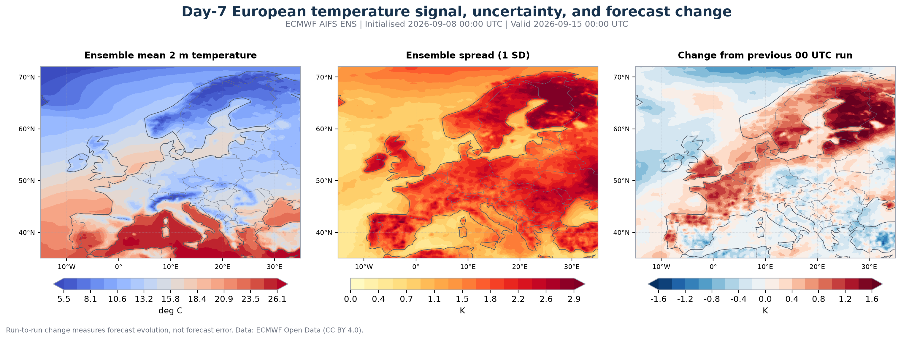
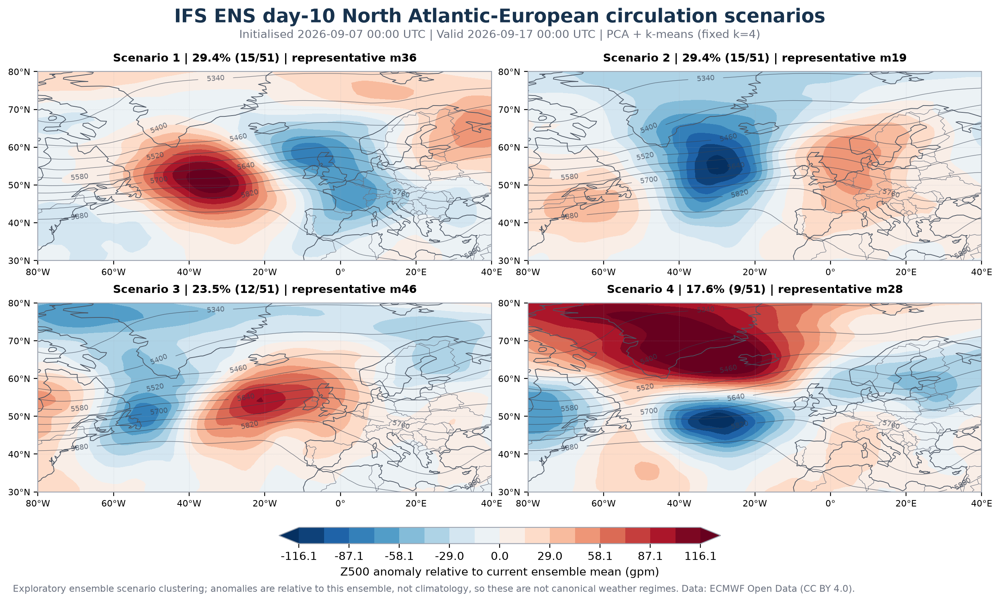
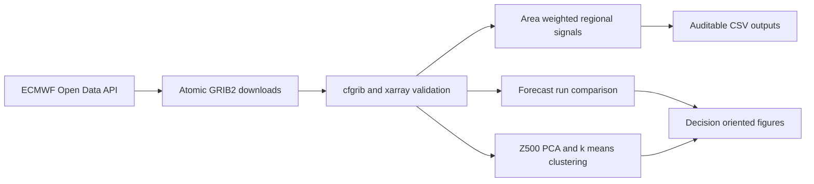

# ECMWF Ensemble Energy Weather Risk Monitor

This project turns live ECMWF ensemble data into a compact, decision-oriented view of European energy-weather risk. It asks four practical questions:

1. What are the 10-day temperature and 100 m wind signals in Nordic, German, and French proxy regions?
2. How does ensemble spread evolve with lead time?
3. How has the forecast changed since the previous 00 UTC run?
4. Which distinct North Atlantic-European circulation scenarios are present at day 10?

It is a weather-risk demonstrator, not a power-price, electricity-demand, hydrology, or wind-generation forecast.

## Example output

The checked-in example uses the ECMWF run initialised at 00 UTC on 7 September 2026.



The day-7 run comparison shows a warmer revision across much of northern and eastern Europe, while the ensemble spread increases toward Scandinavia and eastern Europe. These are forecast-evolution and uncertainty signals; neither is a measure of realised forecast error.



At day 10, four exploratory Z500 scenarios contain 29.4%, 29.4%, 23.5%, and 17.6% of the 51-member set. They separate materially different North Atlantic ridge-trough configurations that can affect downstream European temperature, wind, and precipitation.

Additional figures:

- [Regional 10-day temperature and 100 m wind outlook](figures/regional_energy_outlook.png)
- [Regional ECMWF event probabilities](figures/energy_event_probabilities.png)

For this example, the area-mean gridpoint probability of at least 5 mm precipitation in 24 hours peaks at 46.1% in the Nordic proxy region for the period ending 9 September. This does not mean there is a 46.1% chance that the whole region exceeds 5 mm.

## Scientific workflow



The default workflow downloads roughly 250 MB, although file sizes can change between model cycles.

### Data used

- **AIFS ENS**, 0.25 degree, 6-hourly to 240 hours: ensemble mean and standard deviation of 2 m temperature and 100 m wind speed.
- **AIFS ENS event probabilities**: at least 5 mm precipitation in 24 hours and instantaneous 10 m wind speed of at least 10 m/s.
- **Previous AIFS ENS 00 UTC run**: matched on valid time to calculate run-to-run forecast changes.
- **IFS ENS day-10 Z500**: 50 perturbed members plus the published control forecast.

AIFS ENS supplies compact, energy-relevant ensemble summary fields in the current open-data catalogue. IFS ENS supplies the member-level circulation fields used for physical scenario interpretation.

### Regional aggregation

Regional values are cosine-latitude-weighted averages over transparent rectangular boxes defined in [`config/regions.yml`](config/regions.yml). The boxes are deliberately called *proxies*: they are not bidding zones, catchments, population-weighted demand areas, or wind-fleet masks.

The shaded regional envelopes use the regional average of the pointwise ensemble standard deviation. They are not the ensemble spread of a regional average and are not confidence intervals.

### Circulation scenarios

The clustering code:

1. Subsets Z500 to 30-80 degrees north and 80 degrees west-40 degrees east.
2. Forms anomalies relative to the current ensemble mean.
3. Applies square-root cosine-latitude weighting.
4. Reduces the fields to ten principal components.
5. Uses deterministic k-means with 50 initialisations and a fixed four-cluster design.
6. Reports member counts, empirical scenario fractions, and representative members.

The example PCA representation retains 82.4% of the weighted ensemble variance. The scenarios are not canonical NAO, blocking, or other weather regimes: that would require an appropriate climatology, a regime definition, and out-of-sample validation.

## Run locally

Python 3.11 or newer is required. The ECMWF open-data service does not require an API key.

```bash
python -m venv .venv
source .venv/bin/activate
python -m pip install -e ".[test]"
energy-weather-risk
```

The command selects the latest complete 00 UTC run for which both the AIFS and IFS day-10 inputs exist. To reproduce the checked-in example:

```bash
energy-weather-risk --date 2026-09-07 --hour 0 --source ecmwf
```

If the main portal is busy, choose a supported mirror:

```bash
energy-weather-risk --source google
```

Raw GRIB files are downloaded atomically into `data/raw/`, reused on reruns, and excluded from Git. Small derived CSV files and figures are retained for review. Cartopy downloads Natural Earth 110 m coastlines and borders on first use.

## Test

```bash
pytest -q
```

The tests cover configuration validation, latitude-aware area weighting, exact valid-time selection, and deterministic accounting of all ensemble members in the clustering workflow.

## What this project demonstrates

- Reproducible access to current ECMWF AIFS and IFS open data.
- GRIB2 handling with `cfgrib`, `ecCodes`, and `xarray`.
- Explicit units, valid times, lead times, spatial domains, and area weights.
- Ensemble spread, threshold probabilities, and matched-valid-time forecast changes.
- Physically interpretable circulation scenario clustering with PCA and k-means.
- Tested package structure, command-line execution, cached inputs, and atomic downloads.
- Clear communication of what each output can and cannot support.

## Important limitations and next step

- **Forecast change is not forecast quality.** A previous model run is not an observation.
- **This is a single forecast case.** The empirical cluster fractions describe the current ensemble only.
- **The regional boxes are coarse proxies.** Operational energy analysis would use bidding-zone, catchment, demand, and generation-asset masks.
- **Wind speed is not wind power.** A generation model needs turbine curves, hub-height treatment, air density, availability, and fleet locations.
- **Temperature is not load.** A demand model needs population and calendar effects, nonlinear response, and market-specific calibration.
- **Fixed k=4 is an exploratory choice.** A production method would test stability, sensitivity, and forecast value.

The most useful extension is a proper verification and calibration module. That requires a longer archive of ensemble forecasts or reforecasts plus ERA5 and/or observations. It should report lead-dependent CRPS, Brier scores and skill scores, reliability diagrams, rank histograms, spread-error relationships, and uncertainty from finite samples. ECMWF Open Data keeps only the most recent 12 runs, so this repository does not pretend that two days of rolling data constitute validation.

## Data licence and attribution

ECMWF forecast data are used under the [ECMWF Open Data licence and terms](https://www.ecmwf.int/en/forecasts/datasets/open-data), which specify CC BY 4.0 attribution for the open subset. Retrieval uses the official [`ecmwf-opendata` client](https://github.com/ecmwf/ecmwf-opendata). Natural Earth boundary data are public domain.

The source code in this repository is released under the MIT License. The code licence does not replace or modify the licences of the underlying forecast and map data.

